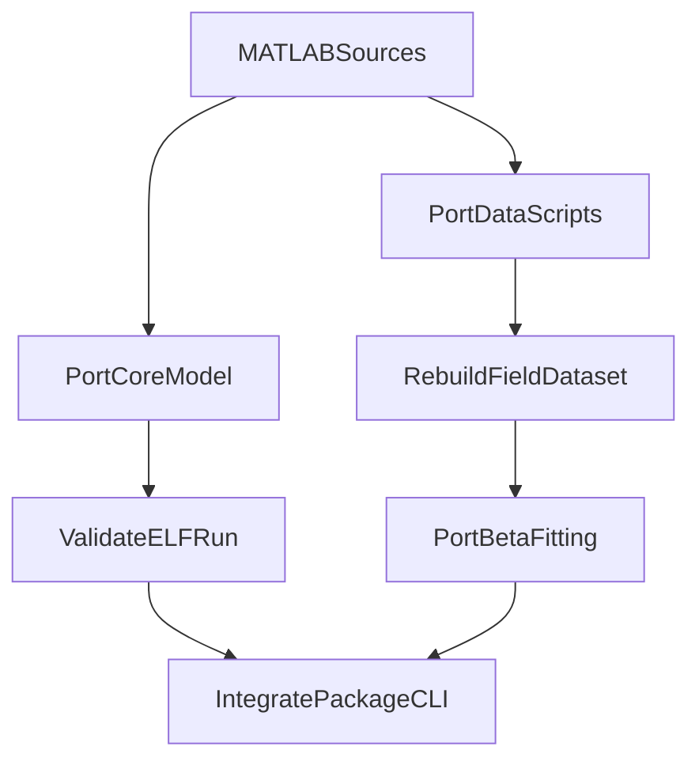

# Plan de migración completa a Python

## Objetivo

Portar todos los archivos de `MATLAB` de `Yang params model` a un paquete Python ejecutable, manteniendo la lógica original, corrigiendo errores heredados detectados en el código fuente y desacoplando rutas absolutas/datos para que el modelo pueda correr desde el repositorio.

## Hallazgos clave

- El núcleo del modelo está en `[C:/Users/anunez/OneDrive - Camara Junior de Ecuador Capítulo Ambato/INSPI/18.1 Ejecutables Python/14. Modelado Dengue/Yang params model/Yang params model/ELF.m](C:/Users/anunez/OneDrive - Camara Junior de Ecuador Capítulo Ambato/INSPI/18.1 Ejecutables Python/14. Modelado Dengue/Yang params model/Yang params model/ELF.m)`, `[C:/Users/anunez/OneDrive - Camara Junior de Ecuador Capítulo Ambato/INSPI/18.1 Ejecutables Python/14. Modelado Dengue/Yang params model/Yang params model/my_parameters.m](C:/Users/anunez/OneDrive - Camara Junior de Ecuador Capítulo Ambato/INSPI/18.1 Ejecutables Python/14. Modelado Dengue/Yang params model/Yang params model/my_parameters.m)`, `[C:/Users/anunez/OneDrive - Camara Junior de Ecuador Capítulo Ambato/INSPI/18.1 Ejecutables Python/14. Modelado Dengue/Yang params model/Yang params model/myODE_ELF.m](C:/Users/anunez/OneDrive - Camara Junior de Ecuador Capítulo Ambato/INSPI/18.1 Ejecutables Python/14. Modelado Dengue/Yang params model/Yang params model/myODE_ELF.m)` y `[C:/Users/anunez/OneDrive - Camara Junior de Ecuador Capítulo Ambato/INSPI/18.1 Ejecutables Python/14. Modelado Dengue/Yang params model/Yang params model/error_fun_betas.m](C:/Users/anunez/OneDrive - Camara Junior de Ecuador Capítulo Ambato/INSPI/18.1 Ejecutables Python/14. Modelado Dengue/Yang params model/Yang params model/error_fun_betas.m)`.
- Hay errores reales en MATLAB que conviene corregir durante el port: `ELF.m` llama `myODE_ELF(t,y)` aunque la función declara `myODE_ELF(t,y,p)`; `error_fun_betas.m` interpola con `tspan` no definido; `time_col_date.m` llama `error_fun_betas(p, data)` aunque la función acepta solo `p`; `params_b_fits.m` usa rutas absolutas y una variable `survival_rate` no definida.
- No aparece `full_table_Lita.mat` en el repositorio, pero sí existe un CSV de campo en `[C:/Users/anunez/OneDrive - Camara Junior de Ecuador Capítulo Ambato/INSPI/18.1 Ejecutables Python/14. Modelado Dengue/Data Mosquitoes/Data Mosquitoes/Scripts/INSPI_CZ9_GIDi_SIT_RLA5074_Field_2018-2019-2020-2021_20230503_DC_CM_FM_XAG.csv](C:/Users/anunez/OneDrive - Camara Junior de Ecuador Capítulo Ambato/INSPI/18.1 Ejecutables Python/14. Modelado Dengue/Data Mosquitoes/Data Mosquitoes/Scripts/INSPI_CZ9_GIDi_SIT_RLA5074_Field_2018-2019-2020-2021_20230503_DC_CM_FM_XAG.csv)`, así que la parte de datos debe rehacerse con rutas relativas y formato validado.

## Enfoque

## Implementación propuesta

1. Crear un paquete Python dentro de la carpeta del modelo, siguiendo la estructura del plan existente, con `__init__.py`, módulos 1:1 para las funciones biológicas y un punto de entrada principal equivalente a `ELF.m`.
2. Reemplazar `global P` por un objeto de configuración central en Python, cargado desde un único módulo, para evitar estado implícito de MATLAB y controlar las dependencias entre `phi_*`, `psi_*`, `mu*` y `myODE_ELF`.
3. Portar primero las funciones escalares/vectorizables de temperatura y tasas (`temp`, `mu*`, `phi*`, `psi*`) cuidando los gotchas ya identificados: `fliplr` en `muL_a`, `polyfit` en `psi1_a`, factores de escala en `my_parameters` y uso directo de `muF_*` en `phi_p_*`.
4. Portar `myODE_ELF` y `ELF` usando `scipy.integrate.solve_ivp`, definiendo explícitamente cómo se pasan los parámetros de competencia para evitar el bug actual de firma inconsistente. El primer objetivo funcional será dejar corriendo la simulación principal con gráficos o salidas reproducibles.
5. Portar `time_col_date` y rediseñar su entrada para leer desde rutas relativas del repositorio. Antes de escribir `full_table_Lita.mat`, validar qué columnas del CSV real mapean a `temp_date`, `Num_aeg` y `Num_alb` para no trasladar supuestos incorrectos del MATLAB original.
6. Portar `error_fun_betas` corrigiendo el bug de `tspan`, separando la carga/preparación de datos de la función objetivo y haciendo que reciba o resuelva sus datos de manera explícita. Con esto se podrá ejecutar `scipy.optimize.minimize` de forma limpia.
7. Portar `params_b_fits` como script auxiliar con rutas configurables y corregir o reemplazar referencias incompletas como `survival_rate`. Si los CSV de literatura no están presentes, dejar el script preparado para correr cuando se aporten esos datos, sin bloquear el resto del paquete.
8. Verificar la migración ejecutando al menos tres recorridos: simulación principal, generación del dataset de campo y ajuste beta. Documentar qué partes quedan totalmente verificadas y cuáles quedan condicionadas a datos externos faltantes.

## Archivos prioritarios

- Núcleo del modelo:
  - `[C:/Users/anunez/OneDrive - Camara Junior de Ecuador Capítulo Ambato/INSPI/18.1 Ejecutables Python/14. Modelado Dengue/Yang params model/Yang params model/ELF.m](C:/Users/anunez/OneDrive - Camara Junior de Ecuador Capítulo Ambato/INSPI/18.1 Ejecutables Python/14. Modelado Dengue/Yang params model/Yang params model/ELF.m)`
  - `[C:/Users/anunez/OneDrive - Camara Junior de Ecuador Capítulo Ambato/INSPI/18.1 Ejecutables Python/14. Modelado Dengue/Yang params model/Yang params model/my_parameters.m](C:/Users/anunez/OneDrive - Camara Junior de Ecuador Capítulo Ambato/INSPI/18.1 Ejecutables Python/14. Modelado Dengue/Yang params model/Yang params model/my_parameters.m)`
  - `[C:/Users/anunez/OneDrive - Camara Junior de Ecuador Capítulo Ambato/INSPI/18.1 Ejecutables Python/14. Modelado Dengue/Yang params model/Yang params model/myODE_ELF.m](C:/Users/anunez/OneDrive - Camara Junior de Ecuador Capítulo Ambato/INSPI/18.1 Ejecutables Python/14. Modelado Dengue/Yang params model/Yang params model/myODE_ELF.m)`
  - `[C:/Users/anunez/OneDrive - Camara Junior de Ecuador Capítulo Ambato/INSPI/18.1 Ejecutables Python/14. Modelado Dengue/Yang params model/Yang params model/error_fun_betas.m](C:/Users/anunez/OneDrive - Camara Junior de Ecuador Capítulo Ambato/INSPI/18.1 Ejecutables Python/14. Modelado Dengue/Yang params model/Yang params model/error_fun_betas.m)`
- Scripts de datos y soporte:
  - `[C:/Users/anunez/OneDrive - Camara Junior de Ecuador Capítulo Ambato/INSPI/18.1 Ejecutables Python/14. Modelado Dengue/Yang params model/Yang params model/time_col_date.m](C:/Users/anunez/OneDrive - Camara Junior de Ecuador Capítulo Ambato/INSPI/18.1 Ejecutables Python/14. Modelado Dengue/Yang params model/Yang params model/time_col_date.m)`
  - `[C:/Users/anunez/OneDrive - Camara Junior de Ecuador Capítulo Ambato/INSPI/18.1 Ejecutables Python/14. Modelado Dengue/Yang params model/Yang params model/params_b_fits.m](C:/Users/anunez/OneDrive - Camara Junior de Ecuador Capítulo Ambato/INSPI/18.1 Ejecutables Python/14. Modelado Dengue/Yang params model/Yang params model/params_b_fits.m)`
  - `[C:/Users/anunez/OneDrive - Camara Junior de Ecuador Capítulo Ambato/INSPI/18.1 Ejecutables Python/14. Modelado Dengue/Data Mosquitoes/Data Mosquitoes/Scripts/INSPI_CZ9_GIDi_SIT_RLA5074_Field_2018-2019-2020-2021_20230503_DC_CM_FM_XAG.csv](C:/Users/anunez/OneDrive - Camara Junior de Ecuador Capítulo Ambato/INSPI/18.1 Ejecutables Python/14. Modelado Dengue/Data Mosquitoes/Data Mosquitoes/Scripts/INSPI_CZ9_GIDi_SIT_RLA5074_Field_2018-2019-2020-2021_20230503_DC_CM_FM_XAG.csv)`

## Validación esperada

- `python -m ...ELF` debe correr sin errores y producir solución temporal consistente.
- La regeneración del dataset debe producir un archivo estructurado para el ajuste.
- `error_fun_betas` debe ser invocable desde `scipy.optimize.minimize` sin variables implícitas ni dependencias ocultas.
- Si faltan datasets de literatura, `params_b_fits` debe quedar degradado de forma clara y documentada, no roto silenciosamente.

